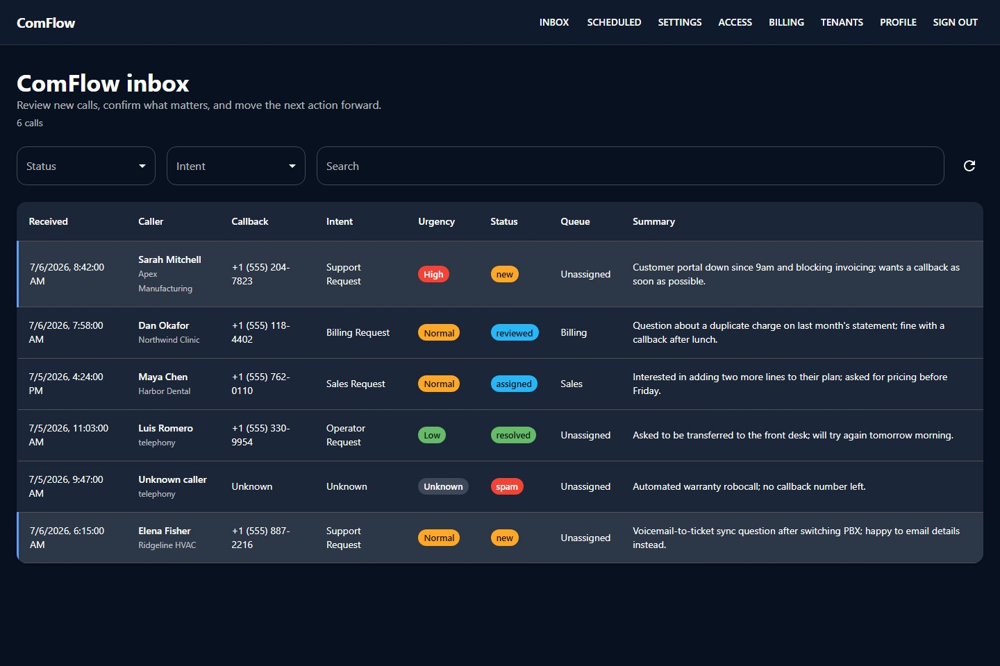

# ComFlow

ComFlow is a **voicemail regulator**: it receives voicemails over SIP, processes
them (transcribe → extract → summarize), gives a team a golden inbox to review
them, and syncs the ones worth acting on into [AnchorDesk](https://github.com/spilloid/AnchorDesk) as
tickets.

It is deliberately **not** an AI receptionist. For full conversational
call-handling, use [agentvoiceresponse](https://github.com/agentvoiceresponse).
ComFlow stays in its lane: receive, process, present, integrate.

Run it two ways: **bring your own SIP trunk and self-host** it for a single team
(open or local-auth, nothing else required), or — new in **3.0** — **run it as a
multi-tenant service** for others: provision DIDs on demand, meter usage, and bill
each customer from a Stripe prepaid wallet behind a hard tenant boundary. See
[Hosting it for others](#hosting-it-for-others-saas).

## How it works

```
SIP source ──SIP/RTP──▶ baresip (SIP edge) ──ctrl_tcp──▶ ComFlow backend
                          │ records WAV                     │ STT → LLM extract
                          ▼ shared /data volume ───────────▶ inbox (React)
                                                             └─(on review)─▶ AnchorDesk
```

- **Receive** — a real SIP user-agent ([baresip](https://github.com/baresip/baresip),
  BSD-3-Clause) registers to your SIP source, answers calls, plays a greeting,
  and records the voicemail. ComFlow writes **no** SIP/RTP code; it drives
  baresip over its `ctrl_tcp` control interface. A `fake` webhook mode is used
  for local dev and tests.
- **Process** — recordings are transcribed (STT) and structured by an LLM:
  caller, company, callback number, intent, urgency, summary.
- **Present** — a React inbox with triage, search, transcript, playback, notes.
- **Integrate** — reviewing/assigning a voicemail pushes it to AnchorDesk as a
  ticket (transcript → description, urgency → priority, recording → attachment).

## What it looks like



More screenshots (call detail, scheduled outbound, DID provisioning, billing,
tenants) are on the [project page](https://spillers-technology.github.io/ComFlow/)
and in [docs/assets/screenshots/](docs/assets/screenshots/). They are captured
from the real web client with mocked API data — regenerate them with
`node docs/scripts/capture-product-media.mjs` while `npm run dev:frontend` is
running (see the header of that script for Playwright setup).

## Features

- **SIP voicemail capture** via baresip (or `fake` webhooks for dev).
- **Pluggable STT/LLM** providers: `fake`, OpenAI, Anthropic, ElevenLabs.
- **Golden single inbox**: list + detail, badges, search, "new" emphasis, light
  polling, notes, editable metadata.
- **AnchorDesk sync** of reviewed ("gilded") voicemails as tickets.
- **Scheduled outbound calls** (tight scope): place a call at a chosen time,
  play a pre-generated message, ask one question, best-effort capture the
  spoken answer. No conversation, no answering-machine detection.
- **Bring-your-own audio**: upload pre-recorded greetings (inbound) and
  message/question audio (outbound) instead of using TTS.
- **Accounts, SSO & teams**: first-class local auth (open by default) plus
  OIDC/SAML SSO; admins manage users, multiple mailboxes/DIDs, and groups that
  grant per-mailbox visibility — all under Settings and Access.
- **Self-service profile + API keys**: signed-in users can edit their profile,
  change local passwords, and create/revoke `cf_` API keys for automation.
- **Hosted MCP endpoint**: `/api/mcp` exposes ComFlow tools and recording
  resources over MCP Streamable HTTP, authenticated by the same `cf_` keys and
  scoped to the key owner's role and mailbox grants.
- **Multi-tenant (hosted mode)**: a hard `tenant_id` boundary isolates every
  customer's users, mailboxes, DIDs, and voicemails. A platform `owner` manages
  tenants and plans; each tenant has its own `admin`.
- **On-the-fly DID provisioning**: order numbers from a SIP trunk provider
  (VoIP.ms) over its API and bind them to a tenant's mailbox — forward your line
  to the DID and it answers. A `fake` provider backs dev/tests.
- **Usage metering & prepaid wallet**: per-tenant metering of minutes, AI, and
  DID rental with transparent carrier-vs-charged pricing; customers fund a Stripe
  prepaid wallet that usage draws down. Per-tenant limits and trunk concurrency
  caps included.

## Repo layout

```text
.
├─ packages/
│  ├─ shared/    # domain models + Zod schemas
│  ├─ backend/   # Express API, SQLite, providers (SIP trunk, billing), gateway
│  ├─ frontend/  # Vite + React + MUI operator UI
│  └─ mcp/       # hosted MCP endpoint (tools + recording resources)
├─ infra/baresip/  # SIP edge: Dockerfile, config, accounts (BYO credentials)
├─ scripts/        # operator scripts (provision tenants/DIDs, usage) — see runbooks
├─ docs/runbooks/  # end-to-end onboarding playbooks
└─ docker-compose.yml
```

## Running it

```bash
npm install
cp .env.example .env
npm run seed          # optional demo data
npm run dev           # backend (:3001) + frontend (:5173)
```

Or the dev stack in Docker (`fake` telephony by default):

```bash
docker compose up --build
```

To run with the real SIP edge, copy `infra/baresip/accounts.example` to
`infra/baresip/accounts`, fill in your SIP source, then:

```bash
COMFLOW_TELEPHONY=baresip docker compose --profile sip up --build
```

> SIP/RTP need reachable UDP and NAT handling — that is baresip configuration,
> see [infra/baresip/README.md](infra/baresip/README.md). ComFlow itself stays
> telephony-protocol-free.

For a production-ish local smoke test before Kubernetes, use the standalone SIP
sample. By default it uses `infra/baresip/accounts.example`, which is enough to
prove the ComFlow container can start and connect to baresip's `ctrl_tcp`
interface, but it will not register a usable phone line:

```bash
docker compose -f docker-compose.sip.sample.yml up --build
```

For a real local SIP test, create the ignored credentials file and point the
sample at it:

```bash
cp infra/baresip/accounts.example infra/baresip/accounts
# edit infra/baresip/accounts with your provider/PBX registration
BARESIP_ACCOUNTS_FILE=./infra/baresip/accounts docker compose -f docker-compose.sip.sample.yml up --build
```

The sample exposes the app at <http://localhost:3001> and publishes
`5060/udp` plus `16384-16584/udp` for RTP media.

Build + verify:

```bash
npm run build
npm test --workspace @comflow/backend
```

## API surface

Open: `GET /api/health`, `POST /api/auth/login`, `GET /api/auth/me`,
`GET /api/auth/providers`, `GET /api/auth/sso/{provider}/start`,
`GET /api/auth/oidc/callback`, `POST /api/auth/saml/acs`,
`POST /api/webhooks/telephony/{inbound,recording-complete}`.

Guarded (pass-through in open mode): `/api/calls*`, `/api/scheduled-calls*`,
`/api/prompts*`, `/api/mailboxes*`, `/api/settings/*`.

Self-service (requires auth, no admin role): `GET/PATCH /api/me`,
`POST /api/me/password`, `GET/POST/DELETE /api/me/keys*`. API key values are
shown once at creation; only metadata is stored and listed afterward.

Admin-only: `/api/groups*` (RBAC group/membership/mailbox-grant management),
`/api/users*` (local user create/role/password/delete), `/api/mailboxes` writes,
`/api/settings/*`, `/api/dids*` (search/provision/release DIDs), `/api/billing/topup`.

Tenant-scoped: `GET /api/usage` (metered usage + transparent pricing),
`GET /api/billing` (wallet). Owner-only: `/api/tenants*` (tenant/plan/limit
management, seed org-admins). Open (machine-to-machine):
`POST /api/webhooks/stripe` (signature-verified wallet credit).

MCP: `POST /api/mcp` (Streamable HTTP) requires `Authorization: Bearer cf_...`.
Session tokens are intentionally not accepted for MCP. Tools mirror the UI:
`list_calls`, `get_call`, `update_call`, `add_note`,
`list_scheduled_call`, `create_scheduled_call`, `cancel_scheduled_call`,
`list_prompt`, `upload_prompt`, `delete_prompt`, `list_mailbox`,
`create_mailbox`, `update_mailbox`, `delete_mailbox`, `get_settings`,
`update_settings`, plus admin user/group tools. Recording files are exposed as
`comflow://recordings/{callId}` resources for calls the key owner can access.

`upload_prompt` accepts base64 audio for dependency-free clients, matching the
REST prompt upload shape. Prefer REST/browser uploads or local file references
when possible; base64 inflates payloads and is discouraged for large audio.

Inbound calls route to a mailbox by dialed DID (`toNumber` → `mailboxes.number`),
then receiving SIP account (`accountLabel` → `mailboxes.sipAccountRef`), else the
default mailbox.

## Configuration

All env vars are documented in [.env.example](.env.example). Highlights:

- **Engines**: `COMFLOW_{OPENAI,ANTHROPIC,ELEVENLABS}_API_KEY`,
  `COMFLOW_DEFAULT_{LLM,STT,TTS}_*`. The backend loads `.env` automatically
  for local runs; Docker/Kubernetes-provided env still wins. Provider
  selections and admin-entered API-key overrides persist in SQLite.
- **Mailbox**: `COMFLOW_DEFAULT_MAILBOX_{NAME,NUMBER,SIP_ACCOUNT_REF}` seeds
  the first mailbox; later edits from the Settings → Mailboxes tab persist.
- **Telephony**: `COMFLOW_TELEPHONY` (`fake`|`baresip`), `BARESIP_CTRL_*`,
  `COMFLOW_GREETING_PATH`, `COMFLOW_SIP_OUTBOUND_DOMAIN`, outbound timing.
- **AnchorDesk**: `ANCHORDESK_SYNC_ENABLED`, `ANCHORDESK_BASE_URL`,
  `ANCHORDESK_API_TOKEN`.
- **Email notifications**: `COMFLOW_EMAIL_NOTIFICATIONS_ENABLED`,
  `COMFLOW_SMTP_*`, `COMFLOW_NOTIFICATION_EMAIL_{FROM,TO}`. Defaults are
  local-Postfix friendly (`127.0.0.1:25`, no auth/TLS unless configured).
- **Auth**: `COMFLOW_AUTH_REQUIRED` (default `false`), `AUTH_SESSION_SECRET`/TTL,
  `COMFLOW_BOOTSTRAP_ADMIN_{EMAIL,PASSWORD}`, `AUTH_LOCAL_ENABLED`,
  `AUTH_ADMIN_EMAILS` (promote-to-admin-on-SSO-login allowlist).
- **SSO**: OIDC via `OIDC_{ISSUER_URL,CLIENT_ID,CLIENT_SECRET,REDIRECT_URI}`
  (Authentik-aligned, auto-enabled when set) and SAML 2.0 via
  `SAML_{ENTRY_POINT,ISSUER,IDP_CERT,CALLBACK_URL}`. Both provision users on first
  login; IdP groups map onto ComFlow groups (Access page).
- **RBAC**: groups grant **mailbox visibility**. Admins see/manage every
  mailbox; members see only the calls/mailboxes their groups grant. Manage groups,
  members, mailbox grants, and SSO group mappings on the **Access** admin page.
- **MCP/API keys**: create `cf_` keys on the Profile page. MCP requests to
  `/api/mcp` act as the key owner; member keys cannot call admin settings,
  group, user, or mailbox-write tools.
- **Multi-tenant + hosted**: `COMFLOW_AUTH_REQUIRED=true` for hosted mode;
  `COMFLOW_DEFAULT_TENANT_*` names the primary tenant; `COMFLOW_DEFAULT_*` plan
  limits (`MAX_DIDS`, `MAX_CONCURRENT`, `INCLUDED_MINUTES`, `MARKUP_BPS`) and
  `COMFLOW_TRUNK_CHANNELS` seed pricing/limits; `COMFLOW_COST_*` set raw
  carrier/AI unit costs.
- **DID provisioning (VoIP.ms)**: `VOIPMS_API_USERNAME`, `VOIPMS_API_PASSWORD`,
  `VOIPMS_SUBACCOUNT` (trunk the DIDs route to), `VOIPMS_DEFAULT_STATE`. Absent
  these, a `fake` provider is used. Override with `COMFLOW_SIP_TRUNK_PROVIDER`.
- **Stripe billing**: `STRIPE_SECRET_KEY`, `STRIPE_WEBHOOK_SECRET`,
  `STRIPE_{SUCCESS,CANCEL}_URL`. Absent these, a `fake` billing provider is used
  and wallet balance is not enforced (self-host stays friction-free).

## Hosting it for others (SaaS)

ComFlow runs two ways: **bring your own trunk and self-host** (open or local-auth
mode, single tenant — nothing below is required), or **run it as a service** for
others. In hosted mode (`COMFLOW_AUTH_REQUIRED=true`) you operate one VoIP.ms
account and one set of AI keys; each customer is an isolated tenant that forwards
their calls to a DID you provision, funds a Stripe prepaid wallet, and signs in to
their own voicemails.

Two end-to-end playbooks, with copy-paste scripts:

- [Onboard a team account](docs/runbooks/onboard-team-account.md) — a customer
  org with its own admin and isolated mailboxes/DIDs.
- [Onboard a paid forward-to user](docs/runbooks/onboard-paid-forward-to-user.md)
  — a single user on a monthly plan with one DID and a Stripe wallet.

Operate the platform from the owner-only **Tenants** page in the UI (onboard
orgs, set plan limits and markup, suspend/activate) or over the REST API (see
`scripts/`). Self-serve signup is on the roadmap; today tenants are provisioned
by the operator.

## Short version

ComFlow captures missed calls over SIP, turns them into structured, reviewable
work, and feeds the ones that matter into AnchorDesk — a focused voicemail
regulator, not a receptionist.
